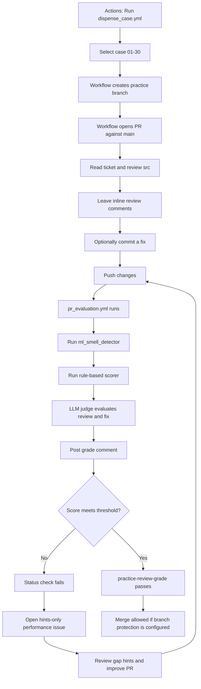

# ml-code-review

A self-training platform for practicing production-oriented code review.

The curriculum has 30 cases in three stages: 10 easy cases with focused bugs,
10 medium cases with interacting modules, and 10 difficult cases requiring
system-level reasoning. Start with `cases/CURRICULUM.md`.

The goal: train your eye to spot the ML anti-patterns that matter in production —
**silent failures** and **latency bottlenecks** — and practice delivering
**coaching-style feedback**:

> "If we deploy this as-is, we risk X happening under load. I suggest we refactor this to use Y."

## What this repo contains

```
cases/            # 30 practice cases, grouped by difficulty (easy/medium/difficult)
  case-XX-name/
    ticket.md           # the PR description / context you're reviewing against
    src/                # the bad code under review
    expected_issues.md  # the answer key (do not read before reviewing!)
    reference_fix/      # fixed code + sample review comments in coaching style
docs/             # practice protocol, review rubric, feedback phrasing templates
skills/           # python-mastery-coach: turns repeated gaps into a study guide
tools/            # scripts to run linters on cases and score your review notes
```

## The cases

| Case | Scenario | Target anti-patterns |
|---|---|---|
| `case-01-model-loading` | FastAPI scoring service | Model loaded from disk inside `predict()`, no input validation, print-logging, hardcoded paths |
| `case-02-data-pipeline` | Pandas batch preprocessing | OOM-prone patterns: `iterrows`, chain indexing, unbounded `read_csv`, no dtype spec, unsafe merges |
| `case-03-llm-batch-job` | LLM batch classification job | No timeouts, no retry/backoff, sequential calls, hardcoded API key, swallowed exceptions, no resume |
| `case-04-training-script` | Sklearn/PyTorch training | No seeds, fit-before-split leakage, accuracy on imbalanced data, no checkpointing, unversioned model saves |
| `case-05-feature-serving` | Feature-enrichment service | Per-row blocking HTTP in the hot path, no caching, no connection pooling, no circuit breaker |
| `case-06-project-hygiene` | Whole mini-project | No dependency pinning, data committed to git, no tests, no CI — manual project-level review |
| `case-07-sklearn-preprocessing` | Train/serve preprocessing library | Refit encoders per request (train/serve skew), unseen categories, division-by-zero features, silent dropna |
| `case-08-pandas-indexing` | Online/offline feature joiner | O(n) scan per online lookup, cross-user label leakage via `shift(-1)`, unvalidated merges, groupby-apply |
| `case-09-numpy-broadcasting` | GPU batch preprocessor | Inverted normalization math (silent garbage), 19GB diagonal matrix OOM, float64 memory ladder, unbounded batches |
| `case-10-seaborn-monitoring` | Model quality dashboards | Wrong week-over-week baseline (charts lie), print-based "alert", 15M-point scatter OOM, mean-only drift |

### Medium: cases 11–20

These cases add multiple modules, component contracts, recovery behavior, and operational arithmetic. See `cases/CURRICULUM.md` for the complete catalog.

### Difficult: cases 21–30

These cases require reasoning about ordering, statistical validity, security, distributed systems, and cross-service failure modes.

## Quickstart

```bash
make setup                 # python -m venv .venv && install tools
source .venv/bin/activate

# Practice one case:
make lint CASE=case-01-model-loading   # run ml_smell_detector on the case
cat cases/case-01-model-loading/ticket.md
# -> open cases/case-01-model-loading/src/ and review it out loud,
#    write notes to notes/case-01.md (see docs/feedback_templates.md)

make score CASE=case-01-model-loading NOTES=notes/case-01.md
# -> see which planted issues you caught vs missed

# Compare with the answer key only AFTER scoring yourself:
cat cases/case-01-model-loading/expected_issues.md
cat cases/case-01-model-loading/reference_fix/sample_review.md
```

## The practice loop

1. **Read the ticket** (`ticket.md`) — get the production context (QPS, data size, SLA).
2. **Review the code in `src/`** as if it were a real PR. Speak your feedback out loud.
3. **Write review comments** using the coaching format in `docs/feedback_templates.md`.
4. **Score yourself** with `make score` — the script fuzzy-matches your notes against the answer key.
5. **Run the linters** (`make lint`) to see what automated tooling catches — and notice what it *misses* (that's what humans are for).
6. **Read the answer key** (`expected_issues.md`) and the sample review. Note the gaps in your rubric.
7. **Repeat** — spaced repetition works: revisit cases weekly until you catch 100% of P1/P2 issues.

See `docs/practice_protocol.md` for the full timed protocol and `docs/review_rubric.md`
for the checklist to internalize.

## Tooling

- **[ml-code-smell-detector](https://github.com/KarthikShivasankar/ml_smells_detector)**
  (PyPI: `ml-code-smell-detector`) by Karthik Shivasankar — AST-based static analysis of
  ML smells across pandas/NumPy/sklearn/PyTorch/TF/HuggingFace. Used to auto-check cases.
  *(Packaged as MLScent; MIT license.)*

The detector is a **second pair of eyes, not the answer key**. It confirms some planted issues
and misses others — project-level hygiene and production failure semantics still require human review.

## CI

`.github/workflows/ci.yml` runs `ml_smell_detector` on every case's `src/` on each push and
fails if a case produces **zero** findings — guaranteeing the case set stays "bad enough" to
train on. It also dogs-foods the scorer by grading the bundled sample reviews.

`.github/workflows/cases_ci.yml` runs the case-structure checks and the static
analysis where applicable. `.github/workflows/pr_evaluation.yml` grades practice
PRs, opens a hints-only tracking issue when the grade is below the bar, and
blocks merging through the required status check.

## PR mode (agent evaluation + merge gate)

Practice through GitHub Flow: dispense a case → a PR opens for you → review and
fix inside the PR → the grading action scores your review + fix and blocks merge
until your score meets the bar. Setup: `docs/github_flow.md`.

## License

MIT (cases and docs in this repo). Third-party tools retain their own licenses.

### Case breakdown

Use this table to choose a case and understand which performance gap it tracks.
The **tracking area** is the main review skill; individual cases may contain
additional secondary issues.

| Case | Difficulty | Main tracking area | What to watch for |
|---|---|---|---|
| 01 — model loading | Easy | Latency / serving lifecycle | Loading artifacts per request, validation, feature order |
| 02 — data pipeline | Easy | Memory / pandas performance | OOM risk, row-wise operations, merge explosions |
| 03 — LLM batch job | Easy | Reliability / external APIs | Timeouts, retries, rate limits, swallowed failures |
| 04 — training script | Easy | Reproducibility / data quality | Seeds, leakage, gradient handling, artifact promotion |
| 05 — feature serving | Easy | Latency / dependency resilience | Blocking I/O, caching, connection pools, stale fallback |
| 06 — project hygiene | Easy | Maintainability / delivery | Dependencies, data in git, tests, CI, artifact provenance |
| 07 — sklearn preprocessing | Easy | Train/serve consistency | Re-fitting transforms, unknown categories, invalid features |
| 08 — pandas indexing | Easy | Latency / data correctness | O(n) lookups, label leakage, merge validation, groupby cost |
| 09 — numpy broadcasting | Easy | Memory / numerical correctness | Broadcasting math, intermediate allocations, dtype promotion |
| 10 — seaborn monitoring | Easy | Observability / memory | Misleading baselines, expensive plots, ineffective alerts |
| 11 — batch inference queue | Medium | Reliability / backpressure | Model lifecycle, acknowledgements, duplicate processing |
| 12 — feature freshness | Medium | Freshness / concurrency | Cache stampedes, stale values, atomic snapshots |
| 13 — data contract drift | Medium | Data quality / silent failure | Schema validation, coercion, quality gates, lineage |
| 14 — distributed training | Medium | Reproducibility / distributed state | Samplers, rank coordination, checkpoint integrity |
| 15 — workflow idempotency | Medium | Reliability / recovery | Timeouts, retries, durable state, promotion gates |
| 16 — canary deployment | Medium | Statistical validity / rollback | Sample size, confidence, operational guardrails, races |
| 17 — streaming inference | Medium | Reliability / event processing | Offset commits, ordering, replay, micro-batching |
| 18 — PII observability | Medium | Security / observability | Redaction, structured telemetry, log cost and latency |
| 19 — hyperparameter search | Medium | Evaluation integrity / cost | Validation overfit, seeds, GPU resources, promotion |
| 20 — GPU serving | Medium | Latency / resource utilization | Micro-batching, synchronization, overload limits |
| 21 — point-in-time features | Difficult | Data leakage / temporal correctness | As-of joins, event-time windows, temporal validation |
| 22 — LLM gateway | Difficult | Multi-tenant reliability / security | Tenant identity, budgets, breakers, malformed responses |
| 23 — retraining orchestrator | Difficult | Concurrency / artifact integrity | Shared paths, promotion races, immutable lineage |
| 24 — statistical rollback | Difficult | Statistical validity / operations | Confidence, tail latency, fail-closed decisions |
| 25 — distributed join | Difficult | Distributed performance / memory | Driver OOM, partition skew, atomic outputs |
| 26 — model supply chain | Difficult | Security / artifact integrity | SSRF, unsafe deserialization, signatures, atomic writes |
| 27 — event-time streaming | Difficult | State / temporal correctness | Watermarks, bounded state, recovery, deduplication |
| 28 — fairness calibration | Difficult | Model quality / fairness | Threshold policy, missing groups, confidence-aware metrics |
| 29 — ensemble hedging | Difficult | Latency / dependency cost | Deadlines, cancellation, connection reuse, fallbacks |
| 30 — artifact hot reload | Difficult | Memory / consistency / lifecycle | Atomic generations, old-model release, reload failures |

When a PR fails, the tracking issue records the case difficulty, score, and
hints for the missed areas without exposing the solution. Filter GitHub Issues
by `practice-tracking`, `easy`, `medium`, or `difficult` to review your gaps.

## GitHub workflow

The repository uses three GitHub Actions workflows:

| Workflow | Trigger | Purpose |
|---|---|---|
| `dispense_case.yml` | Manually from **Actions → Run workflow** | Selects one of the 30 cases, creates a practice branch, and opens a PR with the review checklist. |
| `pr_evaluation.yml` | PR opened, edited, reopened, or updated | Collects your PR body, inline review comments, and code changes; runs the static detector and scorer; asks the review agent for a FIXED / IDENTIFIED / MISSED assessment; posts the score. |
| `cases_ci.yml` | Push to `main` | Checks that every case still has its required training files and runs static analysis where applicable. |

### Practice PR lifecycle



### What `pr_evaluation.yml` evaluates

1. **The case context** — production scale, QPS, memory, latency budget, and failure expectations from `ticket.md`.
2. **Your written review** — PR description, review summaries, and inline comments on the diff.
3. **Your code changes** — whether the proposed fix actually removes the planted production risk.
4. **Static-analysis output** — useful signals from `ml-code-smell-detector`, but not the final answer.
5. **The case rubric** — the grader classifies each issue as:
   - `FIXED`: the code change correctly addresses it
   - `IDENTIFIED`: you described the risk but did not implement the fix
   - `MISSED`: the issue was not recognized or the proposed fix is unsafe

### Score and merge gate

The workflow publishes the `practice-review-grade` status check. The default
thresholds are configured in `.github/workflows/pr_evaluation.yml`:

| Score | Default threshold | Meaning |
|---|---:|---|
| P1 | 85% | Catch the important silent-failure and outage risks |
| P2 | 60% | Catch the significant performance and maintainability risks |
| Overall | 70% | Meet the minimum combined score |

To make the check a real merge block, configure GitHub branch protection or a
ruleset for `main` and mark `practice-review-grade` as a required status check.
Without branch protection, the workflow reports failure but GitHub may still
allow a merge.

### Failed PR tracking

When a score is below the threshold, the workflow opens a GitHub Issue containing:

- Case name and difficulty level
- P1, P2, and overall score
- Missed issue categories
- Hints describing where to look next
- No copied solution from `expected_issues.md`

Use labels `practice-tracking`, `easy`, `medium`, and `difficult` to filter
performance history. Improve the PR, push again, pass the status check, then
close the tracking issue with a short reflection.

### Study guide from recurring gaps

`tools/gap_analysis.py` reads the `practice-tracking` issues, buckets each
missed hint into a Python/ML-engineering concept, and ranks the weakest ones by
frequency. `skills/python-mastery-coach/` turns that into a personalized study
guide (mental model, why it bites in production, a worked example, and a
self-check exercise per concept) without exposing any case's answer key.

